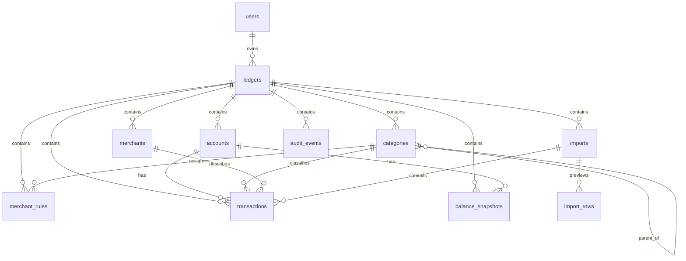

# Vault V1 Data Model

## Status

Draft for collaboration.

This document translates the V1 PRD into an implementation-ready relational data model. V1 is single-user, but every financial object is scoped to a personal `ledger` so future household collaboration can be added without rewriting the ledger.

V1 implementation decision: use Postgres with Drizzle ORM and committed migrations.

## Data Model Principles

1. **Every financial row has an ownership boundary.** In V1 that boundary is `ledger_id`.
2. **Never trust client-submitted ownership.** Server code derives the authorized ledger from the authenticated user.
3. **Money is stored as integer minor units.** For USD, `$12.34` is `1234`.
4. **Financial records are durable.** Prefer soft delete and audit logs over hard deletes.
5. **Imports are staged.** Parsed rows are previewed before transactions are committed.
6. **Reports are traceable.** Report totals must map back to transaction filters.
7. **Defaults are copied, not globally shared.** Categories are seeded into each ledger so users can customize freely.
8. **Vault is transaction-ledger software, not double-entry accounting software.** Use `transactions` for bank/card activity; do not introduce `ledger_entries`, journal entries, trial balances, debits/credits, or chart-of-accounts concepts in V1.

## Naming Conventions

- Primary keys: `id uuid primary key`.
- Ownership: `ledger_id uuid not null`.
- Timestamps: `created_at`, `updated_at`, and `deleted_at` where soft delete is needed.
- Money: `*_minor bigint` plus `currency text`.
- External identity: `auth_provider_subject`.
- Slugs: lowercase stable identifiers where useful; display names remain editable.

## Core Entities

### Entity Relationship Overview



## Tables

## `users`

Represents an authenticated human user in Vault. Identity is owned by Clerk; Vault stores the local profile and links records to the Clerk subject.

Fields:

| Column | Type | Notes |
|--------|------|-------|
| `id` | `uuid` | Primary key |
| `auth_provider` | `text` | V1: `clerk` |
| `auth_provider_subject` | `text` | Stable Clerk user ID |
| `email` | `text` | Latest known email |
| `display_name` | `text` | Nullable |
| `avatar_url` | `text` | Nullable |
| `created_at` | `timestamptz` | Required |
| `updated_at` | `timestamptz` | Required |
| `last_seen_at` | `timestamptz` | Nullable |

Constraints and indexes:

- Unique: `(auth_provider, auth_provider_subject)`.
- Index: `email`.

Notes:

- Do not use email as the durable identity key.
- User rows should be created or synced after successful Clerk auth.

## `ledgers`

V1 personal ledger. This is the ownership container for all financial data. Future household collaboration can evolve this into multi-member ledgers without changing the ledger tables.

Fields:

| Column | Type | Notes |
|--------|------|-------|
| `id` | `uuid` | Primary key |
| `owner_user_id` | `uuid` | FK to `users.id` |
| `name` | `text` | Example: `Luis's Vault` |
| `default_currency` | `text` | Default `USD` |
| `created_at` | `timestamptz` | Required |
| `updated_at` | `timestamptz` | Required |
| `deleted_at` | `timestamptz` | Soft delete |

Constraints and indexes:

- FK: `owner_user_id -> users.id`.
- Index: `owner_user_id`.
- Check: `default_currency` is 3 uppercase letters.

Authorization:

- V1 allows access only where `ledgers.owner_user_id = current_user.id`.

Future:

- Add `ledger_members` with roles when household collaboration ships.

## `institutions`

Optional normalized institution list per ledger. Keeps account metadata consistent without forcing every account to have a formal institution.

Fields:

| Column | Type | Notes |
|--------|------|-------|
| `id` | `uuid` | Primary key |
| `ledger_id` | `uuid` | FK to `ledgers.id` |
| `name` | `text` | Required |
| `website_url` | `text` | Nullable |
| `logo_url` | `text` | Nullable |
| `created_at` | `timestamptz` | Required |
| `updated_at` | `timestamptz` | Required |
| `deleted_at` | `timestamptz` | Soft delete |

Constraints and indexes:

- Index: `(ledger_id, name)`.
- Optional unique, case-insensitive: one active institution name per ledger.

## `accounts`

Financial accounts configured by the user.

Fields:

| Column | Type | Notes |
|--------|------|-------|
| `id` | `uuid` | Primary key |
| `ledger_id` | `uuid` | FK to `ledgers.id` |
| `institution_id` | `uuid` | Nullable FK |
| `name` | `text` | User-facing account name |
| `official_name` | `text` | Optional imported/original name |
| `mask` | `text` | Last four or nickname; not full account number |
| `type` | `text` | See account type enum below |
| `asset_class` | `text` | `asset` or `liability` |
| `currency` | `text` | Default `USD` |
| `color` | `text` | Nullable |
| `icon` | `text` | Nullable |
| `opened_on` | `date` | Nullable |
| `closed_on` | `date` | Nullable |
| `is_active` | `boolean` | Default true |
| `is_hidden` | `boolean` | Default false |
| `notes` | `text` | Nullable |
| `sort_order` | `integer` | Default 0 |
| `created_at` | `timestamptz` | Required |
| `updated_at` | `timestamptz` | Required |
| `deleted_at` | `timestamptz` | Soft delete |

Account types:

- `checking`
- `savings`
- `credit_card`
- `cash`
- `brokerage`
- `retirement`
- `loan`
- `other_asset`
- `other_liability`

Constraints and indexes:

- FK: `ledger_id -> ledgers.id`.
- FK: `institution_id -> institutions.id`.
- Index: `(ledger_id, is_active)`.
- Index: `(ledger_id, type)`.
- Check: `asset_class in ('asset', 'liability')`.
- Check: `closed_on is null or opened_on is null or closed_on >= opened_on`.
- Check: `currency` is 3 uppercase letters.

Rules:

- Never store full account numbers in V1.
- Account deletion should soft-delete unless no transactions/imports exist.

## `categories`

Ledger-local category taxonomy. Defaults are copied into each ledger.

Fields:

| Column | Type | Notes |
|--------|------|-------|
| `id` | `uuid` | Primary key |
| `ledger_id` | `uuid` | FK to `ledgers.id` |
| `parent_id` | `uuid` | Nullable self-FK |
| `name` | `text` | Required |
| `slug` | `text` | Stable within ledger |
| `flow_type` | `text` | `inflow`, `outflow`, `transfer` |
| `color` | `text` | Nullable |
| `icon` | `text` | Nullable |
| `sort_order` | `integer` | Default 0 |
| `is_system` | `boolean` | True for seeded defaults |
| `is_archived` | `boolean` | Default false |
| `created_at` | `timestamptz` | Required |
| `updated_at` | `timestamptz` | Required |
| `deleted_at` | `timestamptz` | Soft delete, rarely used |

Constraints and indexes:

- Unique: `(ledger_id, slug)`.
- Index: `(ledger_id, parent_id)`.
- Index: `(ledger_id, flow_type)`.
- Check: `flow_type in ('inflow', 'outflow', 'transfer')`.
- Check: `parent_id is null or parent_id <> id`.

Rules:

- Archived categories stay valid for existing transactions.
- Parent and child categories must belong to the same ledger.
- A transaction can use either parent or child category in V1.

## `merchants`

Normalized merchants per ledger.

Fields:

| Column | Type | Notes |
|--------|------|-------|
| `id` | `uuid` | Primary key |
| `ledger_id` | `uuid` | FK to `ledgers.id` |
| `name` | `text` | Display name |
| `normalized_name` | `text` | Normalized lookup key |
| `website_url` | `text` | Nullable |
| `logo_url` | `text` | Nullable |
| `created_at` | `timestamptz` | Required |
| `updated_at` | `timestamptz` | Required |
| `deleted_at` | `timestamptz` | Soft delete |

Constraints and indexes:

- Unique: `(ledger_id, normalized_name)` for active merchants.
- Index: `(ledger_id, name)`.

Rules:

- Merchant normalization should be deterministic and tested.
- Renaming merchant display should not mutate raw transaction descriptions.

## `merchant_rules`

Simple V1 merchant-to-category rules.

Fields:

| Column | Type | Notes |
|--------|------|-------|
| `id` | `uuid` | Primary key |
| `ledger_id` | `uuid` | FK to `ledgers.id` |
| `account_id` | `uuid` | Nullable FK; null means all accounts |
| `category_id` | `uuid` | FK to `categories.id` |
| `match_type` | `text` | `exact`, `contains`, `starts_with` |
| `pattern` | `text` | User-visible pattern |
| `normalized_pattern` | `text` | Match key |
| `priority` | `integer` | Default 100 |
| `is_enabled` | `boolean` | Default true |
| `created_at` | `timestamptz` | Required |
| `updated_at` | `timestamptz` | Required |
| `deleted_at` | `timestamptz` | Soft delete |

Constraints and indexes:

- Index: `(ledger_id, is_enabled)`.
- Index: `(ledger_id, account_id)`.
- Index: `(ledger_id, normalized_pattern)`.
- Check: `match_type in ('exact', 'contains', 'starts_with')`.

Rules:

- Rule account and category must belong to the same ledger.
- Rules apply to future imports.
- Applying to existing reviewed transactions requires explicit confirmation.

## `imports`

Represents one CSV import attempt and its lifecycle.

Fields:

| Column | Type | Notes |
|--------|------|-------|
| `id` | `uuid` | Primary key |
| `ledger_id` | `uuid` | FK to `ledgers.id` |
| `account_id` | `uuid` | FK to target account |
| `created_by_user_id` | `uuid` | FK to `users.id` |
| `source_type` | `text` | V1: `csv` |
| `source_file_name` | `text` | Original filename |
| `source_file_size` | `integer` | Bytes |
| `source_file_hash` | `text` | SHA-256 or equivalent |
| `status` | `text` | See lifecycle below |
| `mapping` | `jsonb` | Column mapping used |
| `row_count` | `integer` | Total parsed rows |
| `valid_row_count` | `integer` | Rows eligible to commit |
| `duplicate_row_count` | `integer` | Duplicate rows |
| `failed_row_count` | `integer` | Invalid rows |
| `committed_at` | `timestamptz` | Nullable |
| `rolled_back_at` | `timestamptz` | Nullable |
| `created_at` | `timestamptz` | Required |
| `updated_at` | `timestamptz` | Required |

Statuses:

- `uploaded`
- `parsed`
- `previewed`
- `committed`
- `partially_failed`
- `rolled_back`
- `failed`

Constraints and indexes:

- Index: `(ledger_id, created_at desc)`.
- Index: `(ledger_id, account_id)`.
- Index: `(ledger_id, status)`.
- Check: `source_type = 'csv'` in V1.

Rules:

- Import preview rows are written to `import_rows`.
- Final transactions are created only on commit.
- Rollback marks committed transactions deleted or adds a rollback marker; it does not hard-delete by default.

## `import_rows`

Staged parsed rows for preview, validation, duplicate detection, and commit.

Fields:

| Column | Type | Notes |
|--------|------|-------|
| `id` | `uuid` | Primary key |
| `ledger_id` | `uuid` | FK to `ledgers.id` |
| `import_id` | `uuid` | FK to `imports.id` |
| `row_number` | `integer` | Original CSV row |
| `raw` | `jsonb` | Raw row values |
| `parsed_date` | `date` | Nullable until valid |
| `parsed_posted_date` | `date` | Nullable |
| `parsed_description` | `text` | Nullable |
| `parsed_amount_minor` | `bigint` | Nullable until valid |
| `parsed_currency` | `text` | Default ledger currency |
| `parsed_balance_minor` | `bigint` | Nullable |
| `merchant_id` | `uuid` | Nullable FK |
| `suggested_category_id` | `uuid` | Nullable FK |
| `dedupe_key` | `text` | Content-derived key |
| `status` | `text` | `valid`, `duplicate`, `invalid`, `committed`, `skipped` |
| `error_code` | `text` | Nullable |
| `error_message` | `text` | Nullable |
| `committed_transaction_id` | `uuid` | Nullable FK |
| `created_at` | `timestamptz` | Required |

Constraints and indexes:

- Unique: `(import_id, row_number)`.
- Index: `(ledger_id, import_id)`.
- Index: `(ledger_id, dedupe_key)`.
- Index: `(ledger_id, status)`.

Rules:

- Dedupe key should be deterministic from account, date, amount, and normalized raw description.
- Staged rows should remain after commit for provenance and debugging.

## `transactions`

Core ledger rows. V1 has one category per transaction and no splits.

Naming decision:

- Keep this table named `transactions`.
- Do not rename to `ledger_entries`.
- Vault borrows accounting discipline for auditability, controls, and reconciliation, but V1 is not general-ledger or double-entry accounting software.

Fields:

| Column | Type | Notes |
|--------|------|-------|
| `id` | `uuid` | Primary key |
| `ledger_id` | `uuid` | FK to `ledgers.id` |
| `account_id` | `uuid` | FK to `accounts.id` |
| `category_id` | `uuid` | Nullable FK |
| `merchant_id` | `uuid` | Nullable FK |
| `import_id` | `uuid` | Nullable FK |
| `import_row_id` | `uuid` | Nullable FK |
| `date` | `date` | Required |
| `posted_date` | `date` | Nullable |
| `amount_minor` | `bigint` | Required, signed |
| `currency` | `text` | Required |
| `raw_description` | `text` | Required |
| `display_name` | `text` | Merchant/display text |
| `notes` | `text` | Nullable |
| `tags` | `text[]` | Optional |
| `review_status` | `text` | `needs_review`, `reviewed`, `ignored` |
| `transfer_status` | `text` | `none`, `transfer`, `candidate` |
| `transfer_pair_id` | `uuid` | Nullable self-FK |
| `source` | `text` | `manual`, `csv_import` |
| `dedupe_key` | `text` | Required for imports/manual generated |
| `created_by_user_id` | `uuid` | Nullable FK |
| `updated_by_user_id` | `uuid` | Nullable FK |
| `created_at` | `timestamptz` | Required |
| `updated_at` | `timestamptz` | Required |
| `deleted_at` | `timestamptz` | Soft delete |

Constraints and indexes:

- Unique partial: `(ledger_id, account_id, dedupe_key)` where `deleted_at is null`.
- Index: `(ledger_id, date desc)`.
- Index: `(ledger_id, account_id, date desc)`.
- Index: `(ledger_id, category_id)`.
- Index: `(ledger_id, merchant_id)`.
- Index: `(ledger_id, review_status)`.
- Index: `(ledger_id, transfer_status)`.
- Index: `(ledger_id, import_id)`.
- Check: `review_status in ('needs_review', 'reviewed', 'ignored')`.
- Check: `transfer_status in ('none', 'transfer', 'candidate')`.
- Check: `currency` is 3 uppercase letters.
- Check: `transfer_pair_id is null or transfer_pair_id <> id`.

Rules:

- Amount is signed from the account holder perspective.
- Outflows are negative; inflows are positive.
- Transfers remain in the ledger but are excluded from cashflow by default.
- Client cannot set `ledger_id` directly.

## `balance_snapshots`

Point-in-time balances for net-worth reporting, especially where full transaction history is unavailable.

Fields:

| Column | Type | Notes |
|--------|------|-------|
| `id` | `uuid` | Primary key |
| `ledger_id` | `uuid` | FK to `ledgers.id` |
| `account_id` | `uuid` | FK to `accounts.id` |
| `as_of_date` | `date` | Required |
| `balance_minor` | `bigint` | Required |
| `currency` | `text` | Required |
| `source` | `text` | `manual`, `csv_import`, `system` |
| `created_by_user_id` | `uuid` | Nullable FK |
| `created_at` | `timestamptz` | Required |
| `deleted_at` | `timestamptz` | Soft delete |

Constraints and indexes:

- Unique partial: `(ledger_id, account_id, as_of_date, source)` where `deleted_at is null`.
- Index: `(ledger_id, account_id, as_of_date desc)`.

Rules:

- Snapshots are used where transaction-derived balance is incomplete or unavailable.
- Reports must label whether balance is transaction-derived or snapshot-derived.

## `saved_import_mappings`

Reusable CSV column mappings per ledger/account/institution.

Fields:

| Column | Type | Notes |
|--------|------|-------|
| `id` | `uuid` | Primary key |
| `ledger_id` | `uuid` | FK to `ledgers.id` |
| `account_id` | `uuid` | Nullable FK |
| `institution_id` | `uuid` | Nullable FK |
| `name` | `text` | Required |
| `mapping` | `jsonb` | Required |
| `created_at` | `timestamptz` | Required |
| `updated_at` | `timestamptz` | Required |
| `deleted_at` | `timestamptz` | Soft delete |

Constraints and indexes:

- Index: `(ledger_id, account_id)`.
- Index: `(ledger_id, institution_id)`.

## `export_jobs`

Tracks export/backup generation.

Fields:

| Column | Type | Notes |
|--------|------|-------|
| `id` | `uuid` | Primary key |
| `ledger_id` | `uuid` | FK to `ledgers.id` |
| `created_by_user_id` | `uuid` | FK to `users.id` |
| `type` | `text` | `transactions_csv`, `backup_package` |
| `status` | `text` | `queued`, `running`, `succeeded`, `failed`, `expired` |
| `file_name` | `text` | Nullable |
| `file_size` | `integer` | Nullable |
| `storage_key` | `text` | Nullable if stored |
| `error_message` | `text` | Nullable |
| `expires_at` | `timestamptz` | Nullable |
| `created_at` | `timestamptz` | Required |
| `completed_at` | `timestamptz` | Nullable |

Constraints and indexes:

- Index: `(ledger_id, created_at desc)`.
- Index: `(ledger_id, status)`.

Rules:

- Export generation is audit-logged.
- V1 requires export; full restore is deferred.

## `audit_events`

Append-only activity log for meaningful financial and security-relevant actions.

Fields:

| Column | Type | Notes |
|--------|------|-------|
| `id` | `uuid` | Primary key |
| `ledger_id` | `uuid` | FK to `ledgers.id` |
| `actor_user_id` | `uuid` | Nullable FK to `users.id` |
| `action` | `text` | Stable action string |
| `entity_type` | `text` | Example: `transaction`, `import` |
| `entity_id` | `uuid` | Nullable |
| `before` | `jsonb` | Nullable |
| `after` | `jsonb` | Nullable |
| `metadata` | `jsonb` | Nullable |
| `created_at` | `timestamptz` | Required |

Constraints and indexes:

- Index: `(ledger_id, created_at desc)`.
- Index: `(ledger_id, entity_type, entity_id)`.
- Index: `(ledger_id, action)`.

V1 audit actions:

- `account.created`
- `account.updated`
- `account.closed`
- `account.deleted`
- `category.created`
- `category.updated`
- `category.archived`
- `transaction.created`
- `transaction.updated`
- `transaction.deleted`
- `transaction.bulk_updated`
- `import.created`
- `import.committed`
- `import.rolled_back`
- `merchant_rule.created`
- `merchant_rule.updated`
- `merchant_rule.deleted`
- `merchant_rule.applied`
- `export.created`
- `ledger.updated`
- `ledger.deleted`

Rules:

- Audit events are append-only.
- Do not store secrets in audit payloads.
- Store enough before/after state to understand financial changes.

## Optional V1 Tables

These may be included if implementation cost is low, but they are not essential to the first usable ledger.

### `transaction_filter_views`

Saved transaction filters.

Defer if transaction filtering can be local/browser-only in V1.

### `app_settings`

Ledger-level settings.

Useful for:

- Date format.
- Default report range.
- Default account visibility.

Do not store secrets here in plaintext.

## Deferred Tables

Not V1:

- `ledger_members`
- `invitations`
- `transaction_splits`
- `documents`
- `document_parses`
- `bank_connections`
- `holdings`
- `lots`
- `paystubs`
- `properties`
- `tax_workspaces`
- `ai_usage_events`

Some may appear in later releases. Do not add them early unless a V1 feature truly needs them.

## Key Cross-Table Rules

### Ledger Consistency

Any table with multiple ledger-owned foreign keys must enforce same-ledger consistency in application services and tests.

Examples:

- Transaction account/category/merchant must all belong to the same ledger.
- Merchant rule account/category must belong to the same ledger.
- Balance snapshot account must belong to the same ledger.

Postgres cannot easily enforce every same-ledger relationship with simple FKs unless composite keys are used. V1 should enforce this in domain services and integration tests.

### Soft Delete

Soft delete by default:

- Accounts.
- Institutions.
- Categories.
- Merchants.
- Merchant rules.
- Transactions.
- Balance snapshots.
- Ledgers.

Append-only:

- Audit events.
- Import rows.

Hard delete may be allowed for:

- Uncommitted import rows when deleting a failed/uncommitted import.
- Test/demo data reset in non-production environments.

### Timestamps

All mutable tables need `updated_at`.

Implementation should update `updated_at` through:

- Application service code, or
- Database triggers.

Pick one pattern and use it consistently.

## Reporting Semantics

### Cashflow

Default cashflow includes:

- Non-deleted transactions.
- Categories with `flow_type in ('inflow', 'outflow')`.
- Transactions where `transfer_status != 'transfer'`.

Default cashflow excludes:

- Soft-deleted transactions.
- Transfer categories.
- Transactions marked transfer.

### Net Worth

Net worth uses:

- Asset accounts as positive.
- Liability accounts as negative.
- Transaction-derived balances where complete enough.
- Latest balance snapshot on or before report date where transaction-derived balance is unavailable.

Reports must expose whether a balance is:

- `transaction_derived`
- `manual_snapshot`
- `imported_snapshot`

## Import Dedupe Strategy

V1 dedupe key:

```text
sha256(ledger_id | account_id | date | amount_minor | normalized_raw_description)
```

Optional enhancements:

- Include posted date when available.
- Include original row hash for debugging.
- Allow user to override a duplicate decision during preview.

Rules:

- Dedupe must be deterministic.
- Dedupe should be tested with fixture CSVs.
- Duplicate rows should show in preview rather than silently disappearing.

## Backup Package Shape

V1 backup package should be documented even if restore is deferred.

Suggested files:

```text
manifest.json
users.json
ledgers.json
institutions.json
accounts.json
categories.json
merchants.json
merchant_rules.json
imports.json
import_rows.json
transactions.json
balance_snapshots.json
audit_events.json
```

Manifest fields:

- `format_version`
- `exported_at`
- `app_version`
- `ledger_id`
- `currency`
- `table_counts`

Security:

- Backup exports are sensitive.
- Access requires authentication and ledger ownership.
- Export events are audit-logged.

## Index Checklist

Minimum V1 indexes:

- `users(auth_provider, auth_provider_subject)` unique.
- `ledgers(owner_user_id)`.
- `accounts(ledger_id, is_active)`.
- `accounts(ledger_id, type)`.
- `categories(ledger_id, slug)` unique.
- `categories(ledger_id, parent_id)`.
- `merchants(ledger_id, normalized_name)` unique.
- `merchant_rules(ledger_id, is_enabled)`.
- `imports(ledger_id, created_at desc)`.
- `import_rows(ledger_id, import_id)`.
- `import_rows(ledger_id, dedupe_key)`.
- `transactions(ledger_id, date desc)`.
- `transactions(ledger_id, account_id, date desc)`.
- `transactions(ledger_id, category_id)`.
- `transactions(ledger_id, merchant_id)`.
- `transactions(ledger_id, review_status)`.
- `transactions(ledger_id, import_id)`.
- `balance_snapshots(ledger_id, account_id, as_of_date desc)`.
- `audit_events(ledger_id, created_at desc)`.

## Migration Rules

- Every schema change is a committed migration.
- No production `db:push`.
- Seed category defaults with idempotent seed scripts.
- Migration tests should run in CI.
- Destructive migrations require backup/rollback notes.

## V1 Data Model Open Questions

1. Should the ownership boundary be named `ledgers`, `vaults`, or another accounting-oriented term?
2. Should categories allow only two levels in V1, or support arbitrary depth with UI limited to two? **Decision: V1 product supports two levels only: parent category and child category.**
3. Should backup package include audit events by default? **Decision: yes. Backup packages include audit events by default.**
4. Should transaction tags be `text[]` in V1 or deferred? **Decision: include `tags text[]` on transactions with minimal V1 UX.**
5. Should exports be generated synchronously for small data sets or always through `export_jobs`? **Decision: always create an `export_jobs` record; small exports may complete synchronously.**
6. Should `transactions` be renamed to `ledger_entries`? **Decision: no.**

## Recommended Decisions

- Use `ledgers` as the ownership boundary name.
- Keep the core financial activity table named `transactions`.
- Support parent/child categories only. The schema uses `parent_id`, but services and UI prevent deeper nesting in V1.
- Include audit events in backup package by default. Audit payloads must not contain secrets; later versions may add a reduced export option.
- Include `tags text[]` on transactions. V1 UX is minimal: edit tags on a transaction and optionally filter by tag. Advanced tag management/reporting is deferred.
- Use `export_jobs` for every export. Initial implementation may complete small exports synchronously, but every export is tracked with status, actor, ledger, file metadata, and an audit event.
